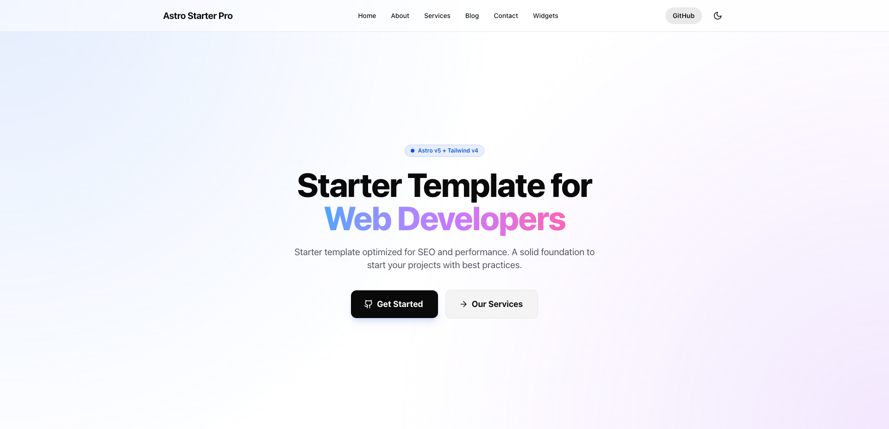

# 🚀 Astro Starter Pro

**Astro Starter Pro** is a professional, open-source template for building fast websites using **[Astro 5](https://astro.build/) + [Tailwind CSS 4](https://tailwindcss.com/)**. Designed with industry best practices, optimized SEO, and a modern development experience.

<br>

[](https://github.com/devgelo-labs/astro-starter-pro)
[](./LICENSE)
[](https://astro.build/)
[](https://tailwindcss.com/)
[](https://github.com/devgelo-labs)

<br>

<details open>
<summary>Table of Contents</summary>

- [Demo](#demo)
- [Features](#features)
- [Quick Start](#quick-start)
- [Configuration](#configuration)
- [Commands](#commands)
- [License](#license)

</details>

<br>

## Demo

📌 [https://astrostarterpro.com/](https://astrostarterpro.com/)

## Features

- ✅ **Dark & Light Mode**: Clean implementation.
- ✅ **Optimized SEO**: Automatic meta tags, Structured Data (JSON-LD), RSS Feed, Open Graph, Twitter Cards, and native Sitemap.
- ✅ **Clean Architecture**: Organized and scalable code.
- ✅ **Reusable Components**: Navbar, Footer, and modern Layouts with Tailwind v4.

<br>



<br>

## Quick Start

To start with this project locally, clone the repository and install dependencies:

```bash
# Clone the repository
git clone https://github.com/devgelo-labs/astro-starter-pro.git

# If you like it, don't forget to leave a star! ⭐
cd astro-starter-pro
npm install
npm run dev
```

<br>

## Configuration

All global site information is managed in `src/config/site.ts`. Update this file with your data:

```typescript
// src/config/site.ts
export const siteConfig = {
  name: "Astro Starter Pro",
  description: "Your SEO description",
  url: "https://astrostarterpro.com",
  author: "Angelo Pescetto",
  // ...
};
```
<br>


<br>

## Commands

| Command             | Action                                             |
| :------------------ | :------------------------------------------------- |
| `npm run dev`       | Starts the development server at `localhost:4321`. |
| `npm run build`     | Generates the static site in the `dist/` folder.   |
| `npm run preview`   | Previews the production build locally.             |
| `npm run lint`      | Runs ESLint to ensure code quality.                |
| `npm run format`    | Formats code with Prettier.                        |
| `npm run fix`       | Runs format and lint auto-fix.                     |
| `npm run check`     | Runs astro check for diagnostics.                  |
| `npm run typecheck` | Verifies TypeScript types.                         |

<br>

## Support the Project

If you find this starter useful, please consider giving it a ⭐ on GitHub! It helps more people discover the project.

<br>

## License

This project is under the **MIT** license. See the [LICENSE](./LICENSE) file for more details.

---

Designed by [Devgelo Labs](https://github.com/devgelo-labs)
